# Tutorial for ExaStoLog: Exact calculation of stationary states + parameter analysis & fitting of stochastic logical models

## What is ExaStoLog?

ExaStoLog is a MATLAB toolbox for the exact solution of stochastic, continuous-time logical models. It was developed in the [Computational Systems Biology group](http://sysbio.curie.fr/) of Institut Curie, by Mihály Koltai.
It is the accompanying tool to [this manuscript](https://www.biorxiv.org/content/10.1101/794230v1).  
The toolbox calculates the stationary solution of stochastic logical models by an exact method, without Monte Carlo simulations. Users can input their own logical models in Boolnet format or as logical formulas in MATLAB. Currently the toolbox can accommodate logical models up to 20-few variables. Pushing the limits of this exact method to larger models is currently explored.  
Besides the calculation itself, the toolbox has a range of other functions for the visualization of solutions, and also to perform different types of parameter sensitivity analysis, as well as parameter fitting.

## Table of contents

1. [Requirements](#1-requirements)
1. [Model creation](#2-model-creation)
      1. [Defining variables and logical rules](#defining-nodes-and-logical-rules)
      1. [Creating the state transition graph](#creating-the-state-transition-graph)
      1. [Defining transition rates](#defining-transition-rates)
      1. [Creating the transition matrix](#creating-the-transition-matrix)
      1. [Defining initial conditions](#defining-initial-conditions)
1. [Calculation of stationary solution](#3-calculation-of-stationary-solution)
1. [Visualizing the stationary solution](#4-visualizing-the-stationary-solution)
      1. [Visualize stationary probability values of attractor states and model variables](#visualize-stationary-probability-values-of-attractor-states-and-model-variables)
      1. [Visualize binary heatmap of nonzero stationary states](#visualize-binary-heatmap-of-nonzero-stationary-states)
1. [One-dimensional parameter sensitivity analysis](#5-one-dimensional-parameter-sensitivity-analysis)
1. [Multi-dimensional parameter sensitivity analysis](#6-multi-dimensional-parameter-sensitivity-analysis)
      1. [Multidimensional parameter scanning with regular grids](#multidimensional-parameter-scanning-with-regular-grids)
	  1. [Multidimensional parameter scanning with Latin Hypercube Sampling](#multidimensional-parameter-scanning-with-latin-hypercube-sampling)
	  1. [Visualize LHS by scatter plots](#visualize-multi-dimensional-parameter-scans-by-scatter-plots)
      1. [Correlations between model variables](#correlations-between-model-variables)
      1. [Regression of variables by transition rates](#regression-of-variables-by-transition-rates)
      1. [Sobol total sensitivity index](#sobol-total-sensitivity-index)
1. [Parameter fitting](#7-parameter-fitting)
	  1. [Simulated annealing](#simulated-annealing)
	  1. [Fitting by initial numerical gradient](#fitting-by-initial-numerical-gradient)

<!--- The steps below are also available and directly executable in [this MATLAB live script](./wrapper.mlx).  --->

### The steps below are contained in and can be directly run from the MATLAB file [tutorial_commands.m](https://github.com/mbkoltai/exact-stoch-log-mod/blob/master/tutorial_commands.m). 
The file [wrapper.m](https://github.com/mbkoltai/exact-stoch-log-mod/blob/master/wrapper.m) contains these commands with further options and explanations.

### 1. Requirements

#### - MATLAB version 2015b or later. The toolbox was tested on Linux (CentOS) and Windows, in MATLAB 2015b, 2018a, 2018b, 2019a.

#### - clone the [repository](https://github.com/mbkoltai/exact-stoch-log-mod) and enter the directory

#### - unzip the file 'toolboxes.zip' for the external MATLAB libraries used:

- [export_fig](https://mathworks.com/matlabcentral/fileexchange/23629-export_fig) (export figures as EPS/PDF/PNG as they appear on screen)  
- [Customizable heatmaps](https://mathworks.com/matlabcentral/fileexchange/24253-customizable-heat-maps) (for heatmaps)  
- [Redblue colormap](https://mathworks.com/matlabcentral/fileexchange/25536-red-blue-colormap) (for heatmaps)  
- [distinguishable_colors](https://www.mathworks.com/matlabcentral/fileexchange/29702-generate-maximally-perceptually-distinct-colors) (for lineplots of one dimensional parameter scans. Requires *Image Processing* toolbox!)  
- [tight subplots](https://mathworks.com/matlabcentral/fileexchange/27991-tight_subplot-nh-nw-gap-marg_h-marg_w) (for customizable gaps between subplots)  
- [Simulated annealing](https://mathworks.com/matlabcentral/fileexchange/10548-general-simulated-annealing-algorithm) (parameter fitting by simulated annealing)  

These libraries are for visualizations and parameter fitting, not for the calculations themselves, so they are optional, but we recommend using them for all the features of the toolbox. The extra libraries should now be in the folder *exact\-stoch\-log\-mod*.

#### - add the library folders to the path by 'add_toolboxes_paths'


### 2. Model creation

#### Defining nodes and logical rules

Models can be defined by entering the list of nodes and their corresponding rules as a cell of strings, using MATLAB logical notation ('&', '|', '~', '(', ')'), or by providing the path to a BoolNet file.

We provide below the names of the models we analyzed in the paper and select the EMT model (Cohen et al 2015) to be read in by the function *fcn_bnet_readin*. We also need to specify a folder to save plots to, below we define a subfolder 'doc/sample_plots/' which will contain the figures.


```MATLAB
% names of models
model_name_list = {'mammalian_cc', ...
'krasmodel15vars', ...
'breast_cancer_zanudo2017'....
'EMT_cohen_ModNet',...
'sahin_breast_cancer_refined'}; %
% select the index of one model
model_index=4;
model_name=model_name_list{model_index};

% read in model from BOOLNET file
[nodes,rules]=fcn_bnet_readin(strcat('model_files/',model_name,'.bnet'));

% where to save figures
plot_save_folder=strcat('doc/sample_plots/',model_name,'/');
```

Check if all variables referred to by rules are found in the list of nodes:
```MATLAB
fcn_nodes_rules_cmp(nodes,rules)
```

If the BOOLNET file is not consistent in terms of its nodes and rules, this function displays an error message, otherwise prints *'Model seems correct: all elements in rules found in nodes list'*.

To create the logical model we need to generate a function file:
```MATLAB
truth_table_filename='fcn_truthtable.m';
fcn_write_logicrules(nodes,rules,truth_table_filename)
```
#### Creating the state transition graph

From this function file we generate the state transition graph (STG) of the logical model. This step can take a few seconds and it is independent of the values of transition rates, so it needs to be done only once for a given model:
```MATLAB
tic; stg_cell=fcn_build_stg_cell(truth_table_filename,nodes); toc
```

We can check the density of the STG by dividing the number of actual transitions by that of all possible transitions. 
For the EMT model the density is 8.4e-06:
```MATLAB
sum(sum(cellfun(@(x) numel(x),stg_cell)))/(2^(2*numel(nodes)))
```

#### Defining transition rates

To calculate the stationary states of a model we need to assign values to the *2xn* (n=number of nodes) transition rates of the model.

We can select a subset of the transition rates to have a specific value by their names (always comprised of *d_* or *u_* and the name of the respective node), and also define the vector of values we want them to have.
For example we can write: *chosen_rates={'u_p53','d_AKT1'};  chosen_rates_vals=[0.25, 0.15];*
Alternatively, we can leave both variables empty to have uniform values:
```MATLAB
chosen_rates=[]; chosen_rates_vals=[];
```

Next we call the function to generate the table of transition rates. 
We need to choose if we want to have the rates to have a uniform value or to be sampled from a (normal) distribution, in the latter case we need to specify the mean and standard distribution:
```MATLAB
% ARGUMENTS
% <uniform> assigns a value of 1 to all params. <random> samples from a lognormal distribution
distr_type={'uniform','random'}; 
% if 'random' is chosen, the mean and standard dev of a normal distrib has to be defined
meanval=[]; sd_val=[]; 
transition_rates_table=fcn_trans_rates_table(nodes,distr_type{1},meanval,sd_val,...
						chosen_rates,chosen_rates_vals);
```

#### Creating the transition matrix

Now we can build the transition matrix of the model with the specified transition rates:
```MATLAB
[A_sparse,~]=fcn_build_trans_matr_stgcell(stg_cell,transition_rates_table,'');
```

For the subsequent calculations only the transition matrix *A* is needed as a variable (it is converted to the kinetic matrix within functions).
If we also want to have the kinetic matrix *K* as a variable (*dp(t)/dt=Kp(t)*, as opposed to *p(t+1)=p(t)A*), then run the function as:
```MATLAB
[A_sparse,K_sparse]=fcn_build_trans_matr_stgcell(stg_cell,transition_rates_table,'kinetic');
```
We can visualize the transition matrix by:
```MATLAB
spy(A_sparse);
xlabel('model states'); ylabel('model states'); set(gca,'FontSize',24)
```

To check the size of the largest objects that we've generated so far, run:
```MATLAB
size_limit_mb=1; fcn_objects_memory_size(whos,size_limit_mb)
```

#### Defining initial conditions

We define an initial condition by specifying certain states we want to have a larger than random (1/(2^n)) probability.
To do this we select the nodes we want to have defined values and the total probability of the states which satisfy this defined condition.
For the analyzed models we provided a number of initial conditions that are biologically interesting:

```MATLAB
% selected nodes for inital conditions
initial_fixed_nodes_list=...
{ {'CycE','CycA','CycB','Cdh1','Rb_b1','Rb_b2','p27_b1','p27_b2'}, ... % mammalian_cc
{'cc','KRAS','DSB','cell_death'}, ... % krasmodel15vars
{'Alpelisib', 'Everolimus','PIM','Proliferation','Apoptosis'},...  % breast_cancer_zanudo2017
{'ECMicroenv','DNAdamage','Metastasis','Migration','Invasion','EMT','Apoptosis','Notch_pthw','p53'}, ... % EMT
{'EGF','ERBB1','ERBB2','ERBB3','p21','p27'}}; % sahin_breast_cancer_refined

% values for selected nodes
initial_fixed_nodes_vals_list = {[0 0 0 1 1 1 1 1], ... % mammalian_cc
            [1 1 1 0], ... % krasmodel15vars: [1 1] is cell cycle ON, KRAS mutation ON
            [0 1 0 zeros(1,2)],...  % breast_cancer_zanudo2017
            [1 1 zeros(1,5) 1 0],... % EMT-Cohen model: [0/1 0/1 zeros(1,5)]
            [1 0 0 0 1 1]}; % 1 zeros(1,numel(initial_fixed_nodes_list{model_index})-3) 1 1


% select the initial condition for the model we are working on
initial_fixed_nodes=initial_fixed_nodes_list{model_index}; 
initial_fixed_nodes_vals=initial_fixed_nodes_vals_list{model_index};
```

In this example with the EMT model we set the input nodes ('ECMicroenv','DNAdamage') to 1, the phenotypic ('Metastasis','Migration','Invasion','EMT','Apoptosis') nodes and p53 to 0, and the Notch pathway node (Notch_pthw) to 1.

Then with the function *fcn_define_initial_states* we assign the probability *dom_prob* among the selected states (uniformly or randomly), and the remaining *1-dom_prob* probability is distributed (also uniformly or randomly) among the other possible states:

```MATLAB
dom_prob=1;
% if <random> the probability is randomly distributed among states, if <uniform> uniformly
distrib_types={'random','uniform'};
% if plot_flag non-empty, we get a bar plot of initial values
plot_flag='';
% function assigns a probability of <dom_prob> to states with the fixed nodes
x0=fcn_define_initial_states(initial_fixed_nodes,initial_fixed_nodes_vals,...
				dom_prob,nodes,distrib_types{1},plot_flag);
```

If \<plot_flag> is non-empty we also get a bar plot of the initial states.

We can also define a completely random or uniform probability distribution of initial states:
```MATLAB
% random
x0=zeros(2^n_nodes,1); x0=rand(2^numel(nodes),1); x0=x0/sum(x0);
% uniform
x0=ones(2^numel(nodes),1)/(2^numel(nodes));
```

### 3. Calculation of stationary solution

Topological sorting of the STG, as well as the identification of cycles and subgraphs are parameter-independent steps that we need to perform only once for a model (except if we set transition rates to 0, or change the initial condition), so we do it before the calculation of the solution:
```MATLAB
stg_sorting_cell=fcn_scc_subgraphs(A_sparse,x0);
```

The function outputs its progress and shows how many cycles the STG contains, in the case of the EMT model the calculation is 9 seconds (on a CENTOS computer with 8 cores (Intel(R) Xeon(R) CPU X5472 \@ 3.00GHz) and we get the message:
*cycles of length:1   64  208  224  256 (256640      16       8       8       4 times)*

This is informative because the existence of cycles is the main limiting factor in the staionary solutions's calculation, and cycles larger than 1000 vertices might make the calculation unfeasible.

With the transition matrix, the table of transition rates and the initial condition defined, we can now calculate the stationary solution of the model, that takes around 2-3 seconds for the EMT model:

```MATLAB
tic; 
[stat_sol,term_verts_cell,cell_subgraphs]=...
	split_calc_inverse(A_sparse,stg_sorting_cell,transition_rates_table,x0); 
toc
```

The outputs of the calculation are:  
*stat_sol*: stationary solution for all the states (sparse variable, only nonzero elements shown)  
*term_verts_cell*: index of nonzero states. If the STG is disconnected, this variable is a cell of cells, where the nonzeros states in different subgraphs are in separate cells  
*cell_subgraphs*: indices of (all) states belonging to the STG's different subgraphs

To have the stationary solution (and also the initial states) in terms of the probabilities of the (activation of the) model's _variables_, call the function:
```MATLAB
[stationary_node_vals,init_node_vals]=fcn_calc_init_stat_nodevals(x0,stat_sol,'x0');
```

<!---##################################################################--->
<!---##################################################################--->

### 4. Visualizing the stationary solution

#### Visualize stationary probability values of attractor states and model variables

We can now visualize the stationary solution, along with the transition (or kinetic) matrix of the model.

Call the function _fcn\_plot\_A\_K\_stat\_sol_ with the following arguments:
```MATLAB
% ARGUMENTS
% matrix_input: [], K_sparse or A_sparse (kinetic or transition matrix)
% min_max_col: minimum and max color for heatmap
% fontsize: [font size on the heatmap, title font size for stationary solutions]
% barwidth_states_val: width of the bars for bar plot of stationary solutions of states
% sel_nodes: nodes to show. If left empty, all nodes are shown
% prob_thresh: minimal value for probability to display 
% (useful for visibility if many attractor states or large cyclic attractor(s))

% Call the function by:
sel_nodes=[];
min_max_col=[0 1]; barwidth_states_val=0.8;
% fontsize: [fontsize of plot, fontsize of titles, fontsize of binary states]
fontsize=[18 20 10]; 
plot_settings = [fontsize barwidth_states_val min_max_col]; prob_thresh=0.03;

figure('name','A_K_stat_sol')
fcn_plot_A_K_stat_sol(A_sparse,nodes,sel_nodes,stat_sol,x0,plot_settings,prob_thresh)
```

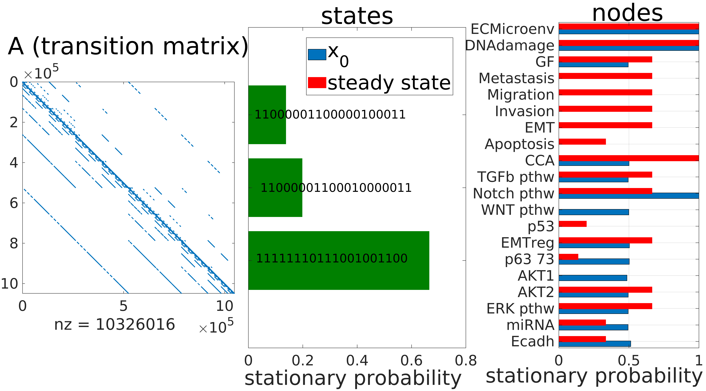

We create a directory for the figures of the model, specify the file types for figures and save the plot by running the following commands (_export\_fig_ toolbox needed, see requirements at the top of the tutorial):
```MATLAB
if exist(plot_save_folder,'dir')==0; mkdir(plot_save_folder); end
fig_file_type={'.png','.eps','.pdf','.jpg','.tif'};
% if <overwrite_flag> non-empty then existing file with same name is overwritten.
overwrite_flag='yes';

% resolution of the figures (dpi)
resolution_dpi='-r350';
% SAVE
fcn_save_fig('single_solution_states_nodes_stat_sol',plot_save_folder,...
fig_file_type{1},overwrite_flag,resolution_dpi)

% to export to PDF you need to have GhostScript installed, install from: https://www.ghostscript.com/
% to export to eps requires pdftops, part of the Xpdf package, install from: % http://www.xpdfreader.com
% see also tutorial of export_fig at: https://github.com/altmany/export_fig/blob/master/README.md
```

#### Visualize binary heatmap of nonzero stationary states

To visualize what model variables are activated for the stable states of the model, we need to provide the following arguments and call the plotting function _fcn_plot_statsol_bin_hmap_, getting a heatmap:

```MATLAB

% stat_sol: vector of stationary solutions
% prob_thresh: probability threshold for states to show (if left empty, all states shown)
prob_thresh=0.01;  
% term_verts_cell: index of subgraphs for stable states
% nodes: name of nodes
% sel_nodes: nodes to show. if none selected, all nodes will be shown
sel_nodes=[];
% plot_param_settings
% num_size_plot: font size of 0/1s on the heatmap
% hor_gap: horizontal gap between terminal SCCs, bottom_marg: bottom margin, left_marg: left margin
numsize_plot=26; fontsize=36; hor_gap=0.02; bottom_marg=0.31; left_marg=0.22;
plot_param_settings=[numsize_plot fontsize hor_gap bottom_marg left_marg];
% tight_subplot_flag: want to use tight subplot? | ranking_flag: order states by probability?
tight_subplot_flag='yes'; ranking_flag='yes';

% PLOT
figure('name','statsol_binary_heatmap')
statsol_binary_heatmap=fcn_plot_statsol_bin_hmap(stat_sol,prob_thresh,...
term_verts_cell,nodes,sel_nodes,plot_param_settings,tight_subplot_flag,ranking_flag);
```

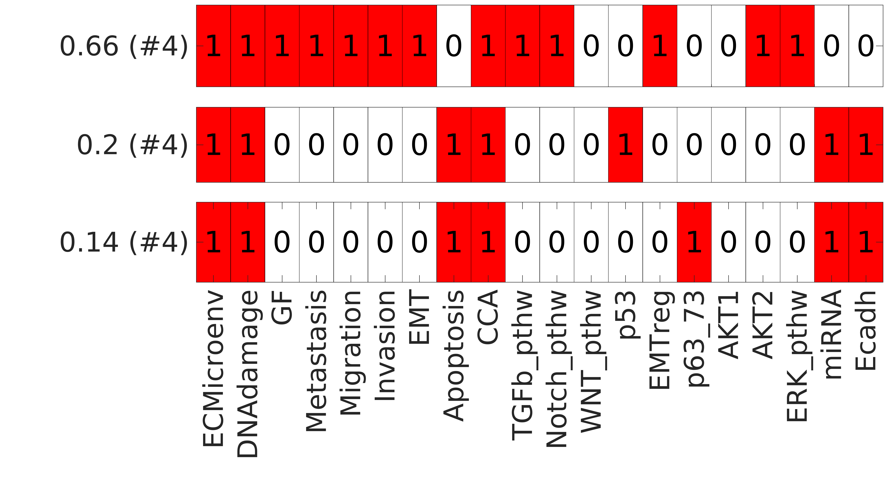

On the y-axis we see the probabilities of the stable states (in parenthesis is the index of the subgraph in which they are located), on the x-axis the variables of the model with the heatmap showing their value (0 or 1).
In the case of cyclic attractors containing multiple states these rows have no gaps in between them (see figure for mammalian cell cycle model in our article).

Save the figure by
```MATLAB
resolution_dpi='-r350';
fcn_save_fig('binary_heatmap_states',plot_save_folder,fig_file_type{1},overwrite_flag,resolution_dpi);
```

<!---##################################################################--->
<!---##################################################################--->

### 5. One-dimensional parameter sensitivity analysis

To investigate the effect of the transition rates we can first perform one-dimensional parameter scans. This means changing the value of parameters one by one and looking at the effect on stationary solutions.

First we need to select the nodes whose transition rates we want to scan in.
We can for instance select all rates that have actual transitions in the subgraph of the STG:
```MATLAB
popul_subgraphs=cellfun(@(x) sum(ismember(find(x0>0),x)), cell_subgraphs)>0;
subgraph_states=cell2mat(cell_subgraphs(popul_subgraphs)');
% subgraph_states=cell2mat(cell_subgraphs(~cellfun(@(x) isempty(x),term_verts_cell))');
state_trans_freq=cell2mat(cellfun(@(x) sum(ismember(x,subgraph_states)), stg_cell','un',0));
[a,b,~]=find(state_trans_freq>0); par_inds_table=[a,b];
```

Now _par\_inds\_table_ contains these transition rates, the first column containing the indices of the corresponding nodes and the second the indices for the type of transition: 1->0 (1) or the 0->1 (2).  

We can also quantify the number of occurrences by transition rates and take the _n_ most common ones:
```MATLAB
% most common transitions
[~,top_freq_trans_rates]=sort(cell2mat(arrayfun(@(x) state_trans_freq(par_inds_table(x,1),par_inds_table(x,2)),...
                                1:size(par_inds_table,1),'un',0)),'descend');
```

We can now select which transition rates we want to scan in.
This is defined by two variables _scan\_params_ contains the index of the corresponding nodes of the rates and _scan\_params\_up\_down_ containing their {1,2} indices (up or down rate).

To select all rates that have transitions we write:
```MATLAB
scan_params=unique(par_inds_table(:,1))';
```

To select the most frequent _n_ rates:
```MATLAB
scan_params=par_inds_table(top_freq_trans_rates(1:6),1)';
```

We can also select nodes by their name:
```MATLAB
scan_params=find(ismember(nodes,{'Notch_pthw','p53','EMTreg','FOXO3','p63_73'}));
```

Then we need to choose if we want to scan in the up or the down rates or both. Here we select all indices that have actual transitions:
```MATLAB
scan_params_up_down=arrayfun(@(x) par_inds_table(par_inds_table(:,1)==x,2)', scan_params,'un',0);
```

We now need to provide the range of values we want to scan in, the resolution of the scan, and whether we want to sample linearly or logarithmically:
```MATLAB
% min and max of range of values; resolution of the scan; linear or logarithmic sampling
parscan_min_max = [1e-2 1e2]; n_steps=10; sampling_types={'log','linear'};
```

Now we can build the table with the parameter values and start the scan. With the settings above we will scan in 36 transition rates, 10 values for each, ie. we'll do 360 calculations, that takes around 15 minutes. Decrease the number of transition rates and/or the resolution of the scan (*n_steps*)
to reduce the calculation time.
```MATLAB
% matrix of parameter values
parscan_matrix=fcn_onedim_parscan_generate_matrix(scan_params,scan_params_up_down,...
		nodes,sampling_types{1},parscan_min_max,n_steps);

% calculation
[stationary_state_vals_onedimscan,stationary_node_vals_onedimscan,stationary_state_inds_scan]=...
    fcn_onedim_parscan_calc(stg_cell,transition_rates_table,x0,...
		nodes,parscan_matrix,scan_params,scan_params_up_down);
```

We can first plot the results grouped by the transition rates of the parameter scan.
In this case, on each subplot we have the stationary value of attractor states or model variables as a function of one transition rate.
We define a threshold for the minimal variation in the value of the variables to be plotted, so variables that do not change as a function of a transition rate are not shown on the plot.

Let's provide the arguments for plotting:
```MATLAB
% index of nonzero states
nonzero_states_inds=find(stat_sol>0);
% plot parameters: [vertical, horizontal] gap between subplots, margins at [bottom, top], [left, right]
height_width_gap=[0.08 0.03]; bott_top_marg =[0.05 0.05]; left_right_marg=[0.04 0.01];
params_tight_subplots={height_width_gap bott_top_marg left_right_marg};
% plot_param_settings: [fontsize_axes,fs_title,fs_legend,linewidth,params_tight_subplots,model_name]
plot_param_settings={14,22,12,4,params_tight_subplots,model_name};
% plotting stater or variables (nodes)?
state_or_node_flags={'nodes','states'};
% cutoff for minimal variation to show a variable
diff_cutoff=0.15;
figure('name','onedim parscan by param')
[fig_filename,onedim_paramscan_output_cell]=fcn_onedim_parscan_plot_by_params(state_or_node_flags{1},...
		stationary_node_vals_onedimscan,stationary_state_vals_onedimscan,...
		nonzero_states_inds,parscan_matrix,nodes,...
		scan_params,scan_params_up_down,... % selected parameters
		diff_cutoff,... % minimal variation for variable to be shown on plot
		plot_param_settings);
```

We show below the plot for the one-dimensional scan of the rates of the 6 nodes that have the most transitions in the STG. 
The size/location of subplots and the line styles were manually adjusted for better visibility.

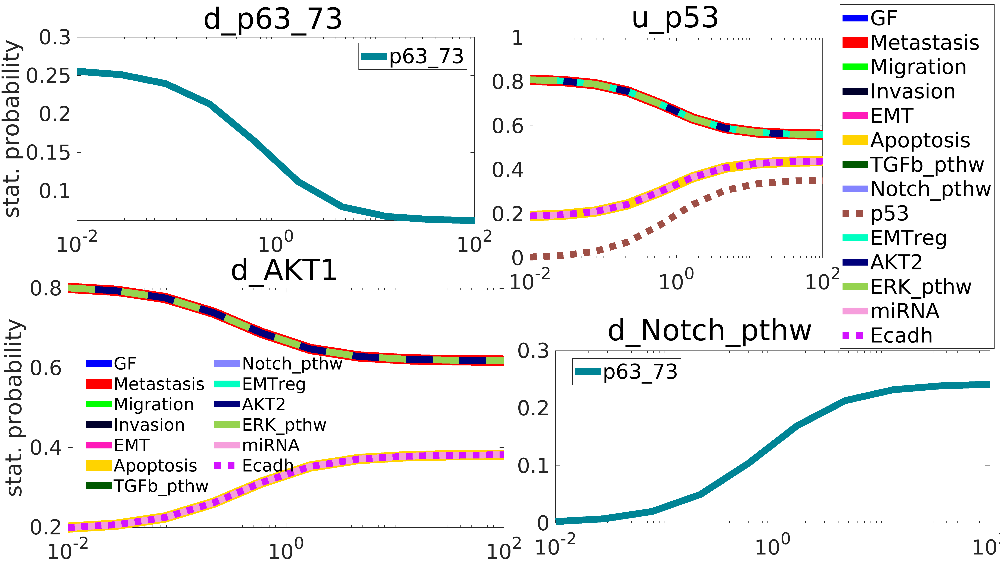


Alternatively, we can plot the results of the parameter scan grouped by variables. 
In this case on each subplot it is the stationary probability of one state or model variable that is shown, as a function of those transition rates that have a significant (threshold set by user) effect on its value.

With the function _fcn\_onedim\_parscan\_plot\_parsensit_ we have multiple ways to plot the results of the parameter scan:
- to plot as a heatmap or lineplot
- to plot the values for the model's nodes or states
- to plot the probability values of states/nodes or their local sensitivity across the transition rate values

Choosing between these is by subsetting the variable (cell) _plot\_types_ variable_.
The arguments of the function are the following:
```MATLAB
% nonzero states of the model
nonzero_states_inds=find(stat_sol>0);
% sensit_cutoff: minimal value for local sensitivity or variation of model/state values
sensit_cutoff=0.1; 
% parameters of plot
height_width_gap=[0.1 0.04]; bott_top_marg=[0.03 0.1]; left_right_marg=[0.07 0.02]; 
params_tight_subplots={height_width_gap bott_top_marg left_right_marg};
% plot_param_settings: [fontsize_axes,fontsize_title,params_tight_subplots,model_name]
plot_param_settings={20,20,params_tight_subplots,model_name,'colorbar'};
% plot_param_settings={12,14,[],model_name}; 
% select type of plot
plot_types={{'lineplot','heatmap'} {'nodes','states'} {'values','sensitivity'}};
plot_type_options=[1 2 1];
```

Then call the function and save the plot as (eg.) PNG:
```MATLAB
figure('name','onedim parscan by vars')
[resp_coeff,scan_params_sensit,scan_params_up_down_sensit,fig_filename]=...
	fcn_onedim_parscan_plot_parsensit(plot_types,plot_type_options,...
		stationary_node_vals_onedimscan,stationary_state_vals_onedimscan,...
		nonzero_states_inds,parscan_matrix,nodes,...
		scan_params,scan_params_up_down,...
		sensit_cutoff,plot_param_settings);

fcn_save_fig(strcat(fig_filename,'_cutoff',strrep(num2str(sensit_cutoff),'.','p')),...
	plot_save_folder,fig_file_type{1},'overwrite','-r200');
```

Below we generate the lineplot of the stationary probability value of the attractor states.
The default titles for states generated by the function are their decimal indices and the binary string of the state itself. 
In the plot below we manually renamed the subplots so that they are more biologically meaningful, as well as changed some line styles and fonts for better visibility. 

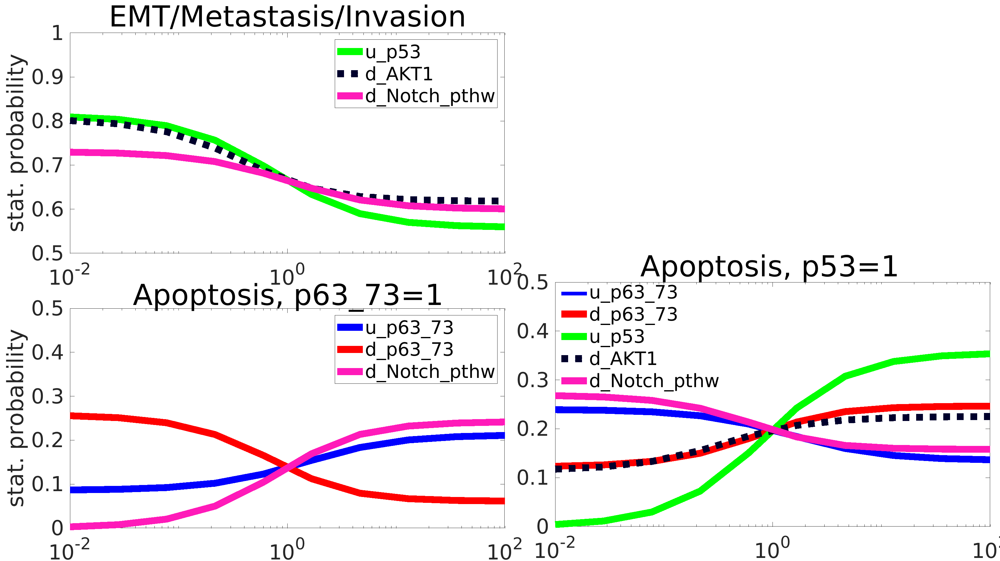

To plot the local sensitivities of the states/variables to the rates, we need to set *plot\_type\_options=[2 2 2];* and call the function again (adjust the plot parameters accodingly):

```MATLAB
plot_type_options=[2 2 2];
% ADJUST plot arrangement
% parameters of plot
height_width_gap=[0.1 0.04]; bott_top_marg=[0.03 0.1]; left_right_marg=[0.07 0.02]; 
params_tight_subplots={height_width_gap bott_top_marg left_right_marg};
% plot_param_settings: [fontsize_axes,fontsize_title,params_tight_subplots,model_name]
plot_param_settings={30,30,params_tight_subplots,model_name,'colorbar'};

figure('name',strjoin(arrayfun(@(x) plot_types{x}{plot_type_options(x)}, ...
		1:numel(plot_type_options), 'un',0),'_'));
[resp_coeff,scan_params_sensit,scan_params_up_down_sensit,fig_filename]=...
			fcn_onedim_parscan_plot_parsensit(plot_types,plot_type_options,...
                          stationary_node_vals_onedimscan,stationary_state_vals_onedimscan,...
                          nonzero_states_inds,parscan_matrix,nodes,...
                          scan_params,scan_params_up_down,... 
                          sensit_cutoff,plot_param_settings);
```

The heatmap looks as the following (states are the same as on previous plot, without renaming the subplots):
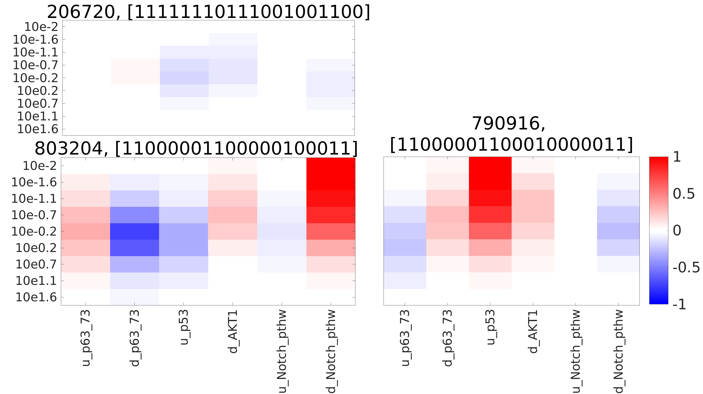


This function has the following outputs (besides the plot itself):
- *resp_coeff*: local sensitivity (response coefficient) matrix of model variables to transition rates
- *scan_pars_sensit*, *scan_params_sensit_up_down*: index of transition rates where at least one model variable has a change in its value (or its local sensitivity's value is) above a certain threshold (in absolute value)

Now we have the transition rates the model is (most) sensitive to and we can use (only) these for multidimensional parameter scanning and/or parameter fitting, which are more intensive calculations.

<!---##################################################################--->
<!---##################################################################--->

### 6. Multi-dimensional parameter sensitivity analysis

In multidimensional parameter scans we are changing the values of all the selected transition rates at the same time, sampling the entire multidimensional parameter space.
This can be done with a regular grid, but the size of this calculation grows exponentially, eg. if we want 5 values for _n_ parameters, we need to perform 5^n calculations. Therefore we recommend to do this (with a regular grid) for two-dimensions only. 
For two dimensions the results can be easily visualized on a heatmap. 

More efficient is Latin Hypercube Sampling (LHS) where we sample the multidimensional space with _n_ sampling points distributed evenly into the _n_ compartments of the hypercube of the parameter space. The location of the sampling points *within* the compartments is random. 

#### Multidimensional parameter scanning with regular grids

For two dimensions we can define the parameter sampling grid by MATLAB's _meshgrid_ command, after defining the range and distribution of sampling points. 
For example we want to sample loguniformly from 1e-2 to 1e2. 
```MATLAB
n_scanvals=10; scanvals=logspace(-2,2,n_scanvals);  % with zero: [0 logspace(-2,2,n_scanvals-1)]
meshgrid_scanvals=meshgrid(scanvals,scanvals);
```

For the function _fcn\_calc\_paramsample\_table_ we need to input the grid as a table with each row as a parameter set and we also need to define the transition rates we want to scan in. 
We know from (Cohen 2015) that shutting down p53 and increasing Notch pathway activity should have a synergistic effect, so we select the transition rates _u\_p53_ and _u\_Notch_pthw_ (nodes [11,13], up rates: {1,1}) and then call the function:
```MATLAB
paramsample_table=[repelem(scanvals,n_scanvals)' ...
	reshape(reshape(repelem(scanvals,n_scanvals),n_scanvals,n_scanvals)',n_scanvals^2,1)]; 
% transition rates to scan in
multiscan_pars=[11 13]; multiscan_pars_up_down={1 1};

disp_var=5; % show at every n% the progress
[stat_sol_paramsample_table,stat_sol_states_paramsample_table]=...
		fcn_calc_paramsample_table(paramsample_table,multiscan_pars,...
		multiscan_pars_up_down,transition_rates_table,stg_cell,x0,disp_var);
```

Plot the results as a two-dimensional heatmap for selected model variable(s), in our case metastasis:
```MATLAB
% what model variables to plot?
sel_nodes=4;
% plot_settings: [fontsize on plot, fs axes, fs subplot titles, fs axes labels]
plot_settings=[28 30 40]; figure('name','2D scan')
fcn_plot_twodim_parscan(stat_sol_paramsample_table,scanvals,...
			multiscan_pars,multiscan_pars_up_down,...
			nodes,sel_nodes,plot_settings)

% SAVE PLOT
resolution_dpi='-r200'; 
file_name_prefix=strcat('twodim_parscan_',strjoin(nodes(sel_nodes),'_'));
fcn_save_fig(file_name_prefix,plot_save_folder,fig_file_type{1},'overwrite',resolution_dpi);
```

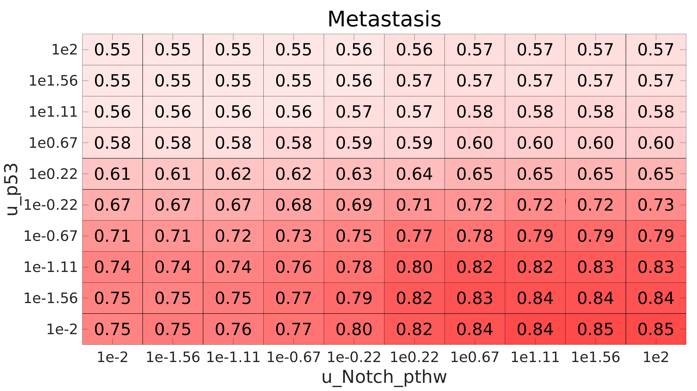


#### Multidimensional parameter scanning with Latin Hypercube Sampling

To perform LHS we need to provide the arguments for the type and properties of the distribution and the sample size. 
For transition rates we can use the sensitive parameters identified by one-dimensional parameter scan.
Below we specify 1000 parameter sets, if the calculation of the stationary solution was 3 seconds, then this would be around 3000 seconds. Decrease *lhs_scan_dim* to reduce the calculation time.

```MATLAB
sampling_types={'lognorm','linear','logunif'}; sampling_type=sampling_types{3};
% par_min_mean: minimum or (if lognormal) mean of distribution. 
%  				Can be a scalar or vector (if different values for different parameters)
% max_stdev: maximum or in case of lognormal the stand dev of distribution. Scalar or vector
%
% for 'lognorm','logunif' provide LOG10 value of desired mean/min & stdev/max (-2 is a mean of 0.01)
par_min_mean=-2; % repmat(1.5,1,numel(cell2mat(scan_params_up_down_sensit(:)))); par_min_mean(4)=3; 
max_stdev=2; 	 % repmat(0.5,1,numel(cell2mat(scan_params_up_down_sensit(:))));
% number of param sets
lhs_scan_dim=1000;

% RUN the LHS
[all_par_vals_lhs,stat_sol_nodes_lhs_parscan,stat_sol_states_lhs_parscan]=... % outputs
    fcn_multidim_parscan_latinhypcube(par_min_mean,max_stdev,sampling_type,lhs_scan_dim, ...
                          scan_params_sensit,scan_params_up_down_sensit, ...
                          transition_rates_table,stg_cell,x0,nodes);
```

The outputs are:
- \<all_par_vals_lhs>: table of parameter sets
- \<stat_sol_lhs_parscan>: stationary values of nodes
- \<stat_sol_states_lhs_parscan>: stationary values of states

#### Visualize multi-dimensional parameter scans by scatter plots

We can plot the results first as scatterplots of a given model variable's or state's values as a function of the scan parameters, with a trendline showing the mean value in a defined number of bins.

First we select the variable to plot and whether we want to plot attractor states or model variables:

```MATLAB
% which variable to plot?
var_ind=1;
% STATES or NODES? <scan_values>: values to be plotted
% model variables: stat_sol_nodes_lhs_parscan; states: stat_sol_states_lhs_parscan
scan_values=stat_sol_states_lhs_parscan; 
```

Set the plot parameters, the first value in <param_settings> defines in how many bins (across the parameter scan range) we calculate the mean points for the trend line). Then call the plotting function.
```MATLAB
sampling_type=sampling_types{3}; % sampling_types={'lognorm','linear','logunif'};
% file_name_prefix=strcat('LHS_parscan_scatterplot_trend_',nodes{var_ind}); 
file_name_prefix=strcat('LHS_parscan_scatterplot_trend_state',num2str(var_ind));
% param_settings: [number_bins_for_mean,trendline_width,axes_fontsize,index nonzero states]
param_settings = [50 6 24 size(stat_sol_states_lhs_parscan)];

figure('name',num2str(var_ind))
fcn_multidim_parscan_scatterplot(var_ind,all_par_vals_lhs,scan_values,...
        scan_params_sensit,scan_params_up_down_sensit,nodes,sampling_type,param_settings)

% SAVE
resolution_dpi='-r200'; 
fcn_save_fig(file_name_prefix,plot_save_folder,fig_file_type{1},'overwrite',resolution_dpi);
```

Below are the results for the apoptotic state with p63\_73 activation:
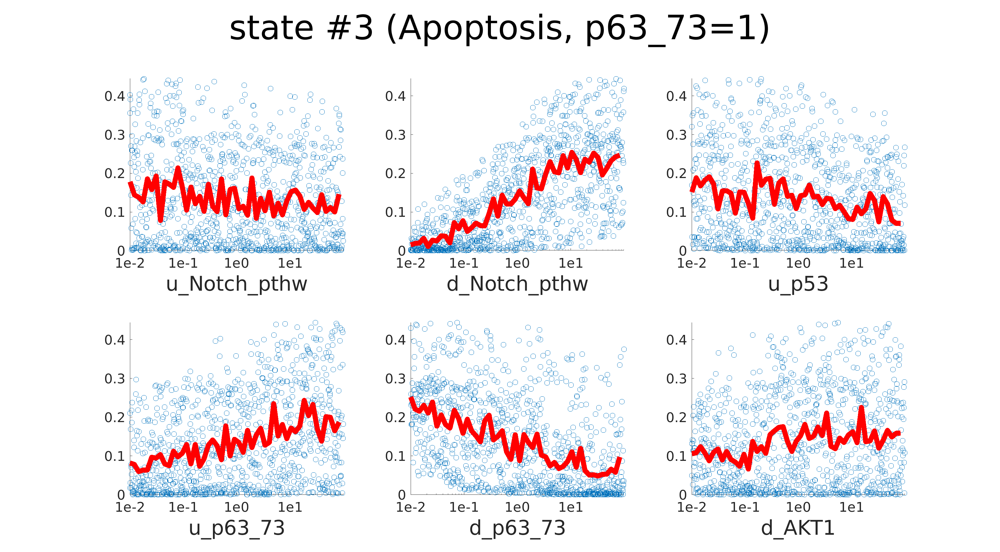


#### Correlations between model variables

Plotting correlations among the variables can reveal what are the upstream nodes that the model's output/phenotypic nodes primarily depend on.
Also if we see that some model variables' values are 100% correlated this can be an indication that the model's effective dimensionality is smaller than its total size.

To plot the heatmap of correlations between the model's variables we need to provide the following arguments (we selected variables below based on previous calculations that showed some of them always have the same values):
```MATLAB
% sel_nodes: name of selected nodes (pls provide in ascending order) (if left empty, all shown)
sel_nodes=[3 7 8 10 11 13:15 17:20]; 
% plot_settings: [fontsize on plot, fontsize on axes/labels]
plot_settings=[NaN 26 32]; 
% we'll plot correlations between variables, as a heatmap
plot_type_flag={'var_var','heatmap'}; 

figure('name',strjoin(plot_type_flag))
[varvar_corr_matr,p_matrix_vars]=...
	fcn_multidim_parscan_parvarcorrs(plot_type_flag,all_par_vals_lhs,...
		stat_sol_nodes_lhs_parscan,nodes,sel_nodes,[],[],[],plot_settings);

% SAVE
resolution_dpi='-r350'; 
fcn_save_fig(fig_prefix,plot_save_folder,fig_file_type{1},'overwrite',resolution_dpi);
```

The plot for our EMT model with the selected variables looks as:

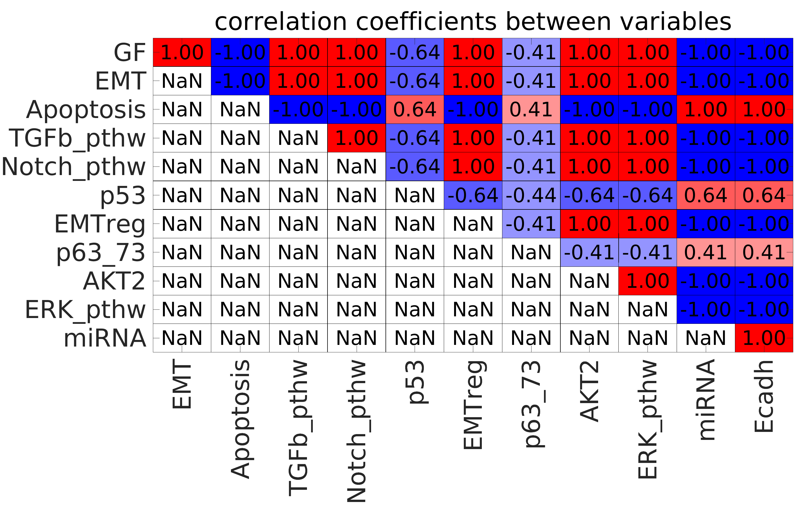

#### Regression of variables by transition rates

We can also perform linear regression of model variables or attractor states as a function of transition rates and plot the regression coefficients (R^2).
We first need to set arguments defining the type and properties of the plot and of the fitting, and also whether we want to fit model variables or states:

```MATLAB
plot_type_flag={'par_var','heatmap','r_sq'}; % {'par_var','heatmap'/'lineplot','r_sq'/'slope'}
sel_nodes=[];
% plot_settings=[fontsize,maximum value for heatmap colors], 
% if plot_settings(3)=NaN, then max color automatically selected
plot_settings=[30 30 0.29]; 
% if regression type is 'linlog', then the fit is y = a + b*log10(x)
regr_types={'log','linear'}; % log recommended if parameter values log-uniformly distributed in sampling
figure('name',strjoin(plot_type_flag))
scan_values=stat_sol_states_lhs_parscan; % or: stat_sol_nodes_lhs_parscan
[r_squared,slope_intercept]=fcn_multidim_parscan_parvarcorrs(plot_type_flag,...
		all_par_vals_lhs,scan_values,...
		nodes,sel_nodes,... % which nodes
		scan_params_sensit,scan_params_up_down_sensit, ... % same params as in LHS!
		regr_types{1},plot_settings)

% SAVE
fig_prefix=strjoin(plot_type_flag,'_'); resolution_dpi='-r350'; 
fcn_save_fig(fig_prefix,plot_save_folder,fig_file_type{1},'overwrite',resolution_dpi)
```

Below is the plot of the regression coefficients for the three attractor states of the EMT model:

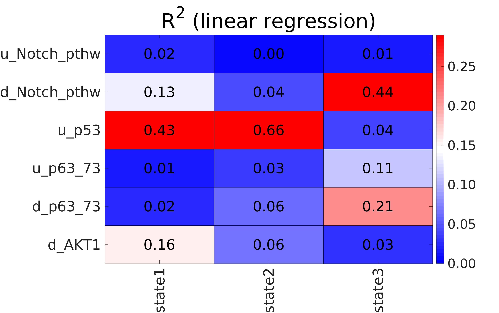

In general we should get strong correlations for the sensitive variables, however if the effect of a transition
rate is non-monotonic this is not necessarily the case.

#### Sobol total sensitivity index

The [Sobol total sensitivity index](https://en.wikipedia.org/wiki/Variance-based_sensitivity_analysis) is a global sensitivity index that indicates how much of the total variance in a variable is due to variation in a given parameter.
As opposed to linear regression this index does not assume monotonicity or linearity of the  parameter effects on variable values.
We calculate here the usual numerical approximation of the analytical equivalent from LHS. 
For the selected transition rates the solutions need to be recalculated to get the Sobol indices, so this can be a time-consuming calculation.

From the previous step of linear regression we can (optionally) take only the transition rates that have an R^2 value above a given threshold:
```MATLAB
% for indexing, we need the sequential indices of transition rates 
% (eg. 5th node's up rate {5,1}->9, 6th node down rate is {6,2}->12)
[par_ind_table,sequential_indices_lhs,~] = ...
	fcn_get_trans_rates_tbl_inds(scan_params_sensit,scan_params_up_down_sensit,nodes);
% threshold for R^2
r_sq_thresh=0.05;
% select transition rates
par_ind_table_filtered=par_ind_table(sum(r_squared>r_sq_thresh)>0,:);
scan_params_filtered=unique(par_ind_table_filtered(:,1))'; 
scan_params_up_down_filtered=...
	arrayfun(@(x) par_ind_table_filtered(par_ind_table_filtered(:,1)==x,2)',...
	scan_params_filtered,'un',0);
```

The sample size (number of parameter sets used for the re-calculations) can be defined, with higher samples giving better estimates.
To calculate Sobol total sensitivity we need <sample_size*(number of analyzed transition rates)> recalculations of the model's stationary solution.

Run the analysis with the following commands:
```MATLAB
sel_nodes=[]; 	% if left empty, all nodes/states are analyzed
sample_size=[]; % if left empty, the sample size is half of the original param scan <all_par_vals_lhs>
% how often (what %) should the progress of calculation be displayed?
disp_freq=10;
% plot settings set to empty bc we are doing the calculation here
plot_settings=[];
var_types={'node','state'}; % analysis for states or nodes
sobol_sensit_index=fcn_multidim_parscan_sobol_sensit_index([],var_types{2},...
	all_par_vals_lhs,stat_sol_nodes_lhs_parscan,stat_sol_states_lhs_parscan,...
	sample_size,... % # of calculations per parameter
	sequential_indices_lhs,... % indices of transition rates in the original LHS
	scan_params_filtered,scan_params_up_down_filtered,... % or: scan_params_sensit,scan_params_up_down_sensit
	stg_cell,transition_rates_table,x0,nodes,sel_nodes,plot_settings,disp_freq);
```

To plot the results, provide the table **sobol_sensit_index** of results as the function's first argument:
```MATLAB
% plot_settings: 
% [fontsize_plot,fs_axes,fs_title,min_color(optional),max_color(opt),angle x-axis labels];
plot_settings=[30 30 40 0 0.5 90];
fcn_multidim_parscan_sobol_sensit_index(sobol_sensit_index,var_types{2},all_par_vals_lhs,[],[],[],...
	sequential_indices_lhs,scan_params_filtered,scan_params_up_down_filtered,[],[],[],...
	nodes,sel_nodes,plot_settings,[]);
xticklabels({'Metastasis','Apoptosis (p53)','Apoptosis (p63_73)'})
% for MATLAB pre-2016b: 
% set(gca,'xtick',1:3);  set(gca,'xticklabel',{'Metastasis','Apoptosis (p53)','Apoptosis (p63_73)'});


% SAVE
resolution_dpi='-r350'; 
fcn_save_fig('sobol_sensitivity_index',plot_save_folder,fig_file_type{1},'overwrite',resolution_dpi)
```

Below is the heatmap of the Sobol total sensitivity indices for the three attractor states of the EMT model:
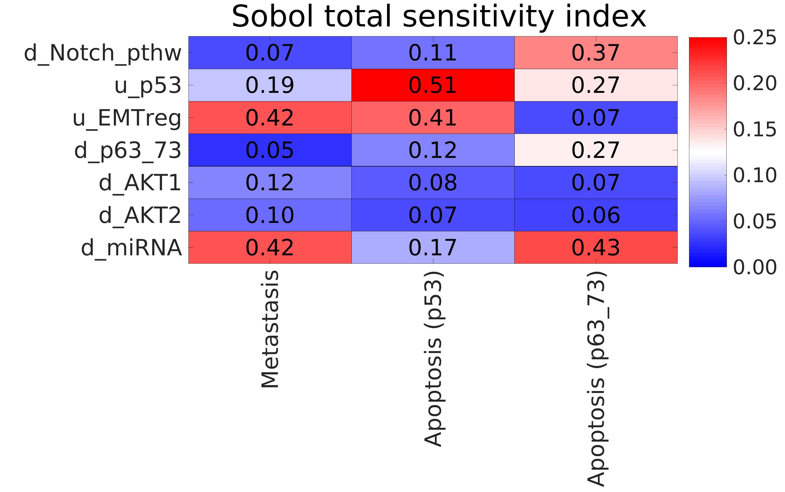

Typically, as in this example, the results are similar to linear regression, but the latter can miss parameters that have a non-monotonic/nonlinear effect.

<!---##################################################################--->
<!---##################################################################--->

### 7. Parameter fitting

Finally, if we have experimental (or simulated) data for a given model, it is possible to perform parameter fitting on the transition rates.  
We can fit a model in terms of the stationary probability values of attractor states or of model variables. Keep in mind that the values for model variables are linear combinations of the values of states.  
First we need to provide the parameters we want to fit, which can be eg. the sensitive transition rates identified above.
We also need to provide a vector of values for the model's variables or states that we want to fit the model to, this is our data.

```MATLAB
[~,~,predictor_names]=fcn_get_trans_rates_tbl_inds(scan_params_sensit,scan_params_up_down_sensit,nodes); 
% define data vector (generate some data OR load from elsewhere)
data_param_vals=lognrnd(1,1,1,numel(predictor_names)); 
% initial guess for parameters
init_par_vals=data_param_vals.*lognrnd(1,2,size(predictor_names)); 

% true value of variables/states, values of states/variables with init param guess, initial error
var_type_flag='vars'; % 'vars' 'states'
[y_data,y_init_pred,init_error]=fcn_param_fitting_data_initguess_error(var_type_flag,...
					x0,stg_cell,data_param_vals,init_par_vals,...
					stg_sorting_cell,nodes,predictor_names);
```

We also need to define anonymous functions to calculate the stationary solution for a given parameter set and its squared error relative to the data:
These functions need to be rerun if we change the data for fitting.
```MATLAB
[fcn_statsol_sum_sq_dev,fcn_statsol_values]=fcn_handles_fitting(var_type_flag,...
				y_data,x0,stg_cell,stg_sorting_cell,nodes,predictor_names);
```

Next we need to decide what parameter fitting method we use.

#### Simulated annealing

Since we do not have the gradient of the stationary solution, a gradient-free method is needed. 
We use first a [simulated annealing script from MATLAB Central](https://mathworks.com/matlabcentral/fileexchange/10548-general-simulated-annealing-algorithm), with the following modifications (to store the convergence process):
- defining \<T_loss\> as 3rd output of the function,
- inserting <counter=0> before the while loop
- inserting <T_loss(counter,:)=[T oldenergy];> at line 175 within the while loop.

(These changes are already written into the script, you do not need to do anything about them.)

**Note that simulated annealing typically shows slow convergence and it can also fail to converge. For error reductions between 50-99% we have encountered convergence times of 1-3 hours.** We provide the convergence process for one of our tested models (Zanudo 2017) in [this csv file](https://github.com/mbkoltai/exact-stoch-log-mod/blob/master/doc/readmeplots/zanudo2017_simul_ann_T_loss.csv), where the initial error was 90% reduced.

The hyperparameters of fitting are defined as the structure _fitting\_arguments_: we set 'Verbosity' to 1 so we can see the convergence process, and 'Stopval' to (eg.) 10% of the initial error, this is the value of the sum of squared error to stop the fitting process at. 
Then we start the fitting:
```MATLAB
% default values for fitting hyperparameters:
% struct('CoolSched',@(T) (0.8*T), 'Generator',@(x) (x+(randperm(length(x))==length(x))*randn/100),...
% 'InitTemp',1,'MaxConsRej',1000, 'MaxSuccess',20,...
% 'MaxTries',300, 'StopTemp',1e-8, 'StopVal',-Inf, 'Verbosity',1);
fitting_arguments=struct('Verbosity',2, 'StopVal', init_error/10, 'MaxTries',30,'MaxConsRej',100);
% FIT
tic; [optim_par_vals,best_error,T_loss]=anneal(fcn_statsol_sum_sq_dev,init_par_vals,fitting_arguments); toc;
```


Below are the commands to plot the convergence process (first subplot) and the true, initial guess and fitted values of model variables (second subplot) of the EMT model:

```MATLAB
% model/state stationary values with the fitted parameters
[y_optim_param,~,~]=fcn_param_fitting_data_initguess_error(var_type_flag,...
			x0,stg_cell,data_param_vals,optim_par_vals,...
			stg_sorting_cell,nodes,predictor_names);

% [initial guess, true values (data), fitted values]
data_init_optim=[y_init'; y_data'; y_optim_param']; 
min_val=min(min(data_init_optim(:,3:end))); max_val=max(max(data_init_optim(:,3:end)));
% parameters: initial guess, true values, fitted values
param_sets=[init_par_vals;data_param_vals;optim_par_vals];

% PLOT: simulated annealing
figure('name','param fitting (simul.ann.)'); 
% select nodes to plot (here we selected nodes that are not always 0 or 1)
sel_nodes=find(sum(data_init_optim)>0 & sum(data_init_optim)<3);
% PLOT fitting process
thres_ind=size(T_loss,1); % thres_ind=find(T_loss(:,2)<1e-2,1); 
plot_settings=[24 30]; 
% var_type_flag='vars'; % 'states'
figure('name','simul anneal')
fcn_plot_paramfitting(var_type_flag,data_init_optim,T_loss,nodes,sel_nodes,[1 2],thres_ind,plot_settings)
```

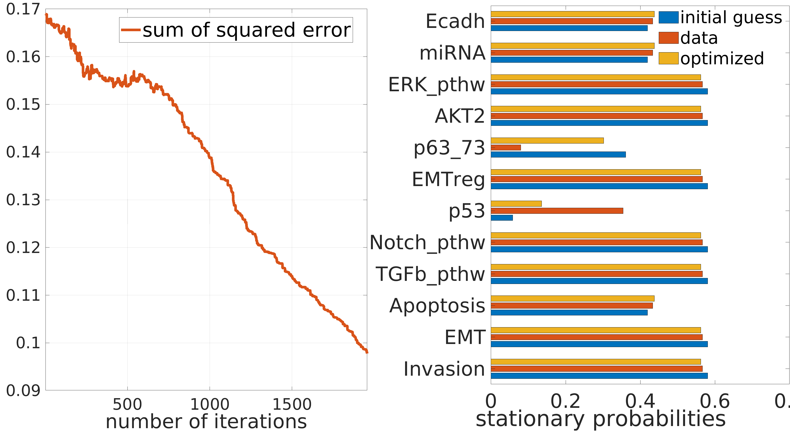

This plot is for a sample fitting process, here model variables were fit with 6 transition rates. 
Since we randomly generate the data and initial guess for parameters, it will look different for a new fitting.

<!---##################################################################--->

#### Fitting by initial numerical gradient

For the 5 models we analyzed the transition rates have a monotonic effect on model variable values. 
We can take an initial, numerically calculated gradient of the error (SSE) as a function of the rates and attempt to reduce the error by incrementing the rates with their initial direction. 

This method is rather crude and does not guarentee to converge, but in some cases we have found it does. 
We have built in a condition into the function that if the error is growing (or stagnating) for 2 consecutive steps the fitting process stops, so that a diverging process is automatically stopped. The evolution of the fitting error is displayed by the function. 

We define at what % of the original error we want the fitting to stop and with what step size the rates are incremented (by their initial derivatives). We then run the fitting function:
```MATLAB
error_thresh_fraction=0.1; 	% what % of initial error to stop?
step_thresh=[]; 	% what step # to stop? you can leave this empty 
% init_error_table: changes to initial error when increasing or decreasing parameter values
init_error_table=[]; % if we have it from previous fitting than feed it to fcn
% incr_resol_init: initial % change from initial param values to calculate the numerical gradient
% incr_resol: change in param values during gradient descent
incr_resol_init=0.15; incr_resol=0.03;

% FIT
% var_type_flag: 'states' or 'vars'
% careful that <var_type_flag> and data type are consistent!!
sel_nodes=[];
data_init_optim=[statsol_parscan([1 end],:); y_data']; 
figure('name','numer grad_desc') 
fcn_plot_paramfitting(var_type_flag,data_init_optim,error_conv,nodes,sel_nodes,[],[],plot_settings)
```

and plot the results by
```MATLAB
% PLOT
% which vars/states to show, if empty all are shown
sel_nodes=[];
data_init_optim=[statsol_parscan([1 end],:); y_data];
figure('name','numer grad_desc')
fcn_plot_paramfitting(data_init_optim,error_conv,nodes,sel_nodes,[],[],plot_settings)

% SAVE
fig_name=strcat('grad_descent',num2str(numel(predictor_names)),'fittingpars');
fcn_save_fig(fig_name,plot_save_folder,fig_file_type{1},'overwrite',resolution_dpi)
```

Below is an example of a succesful fitting of model variables by the initial gradient with the following initial values for the parameters:
```MATLAB
scan_params_sensit=[11 13 15 16];; scan_params_up_down_sensit={2, 1, [1 2], 2};
data_param_vals=[6.7960 2.1261 7.721 8.9191 0.5793];
init_par_vals=[1.2834 0.4969 48.4048 4.9638 0.1760];
```

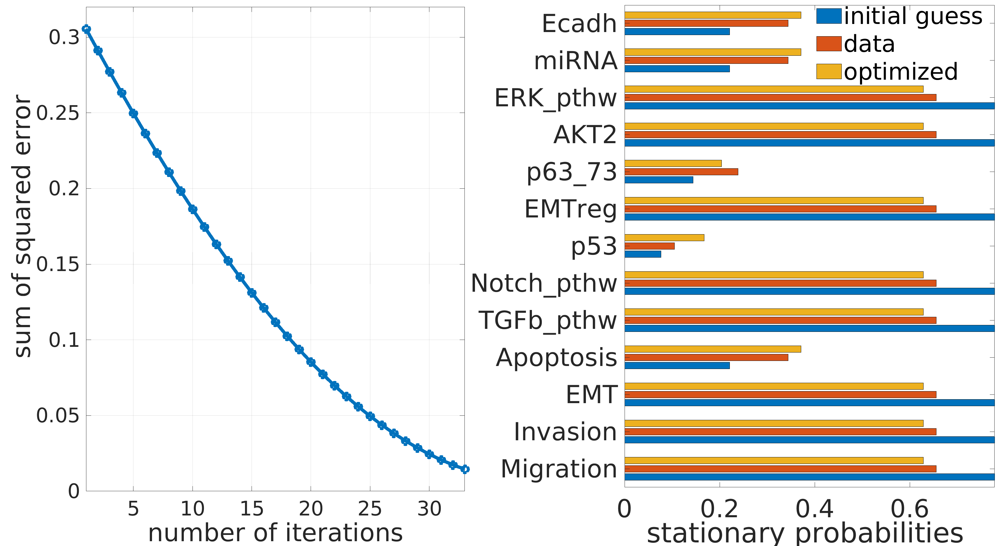


### References 

Cohen, D. P., Martignetti, L., Robine, S., Barillot, E., Zinovyev, A., and Calzone, L. (2015). Mathematical modelling of molecular pathways
enabling tumour cell invasion and migration. PLoS computational biology, 11 (11), e1004571

Zañudo, J. G. T., Scaltriti, M., and Albert, R. (2017). A network modeling approach to elucidate drug resistance mechanisms and predict combinatorial drug treatments in breast cancer. Cancer convergence, 1(1), 5.

<!---##################################################################--->
<!---##################################################################--->

